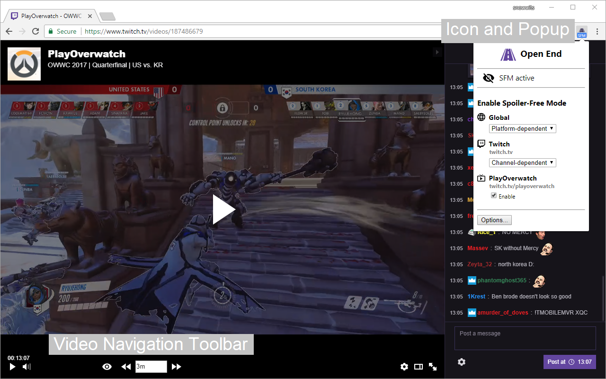
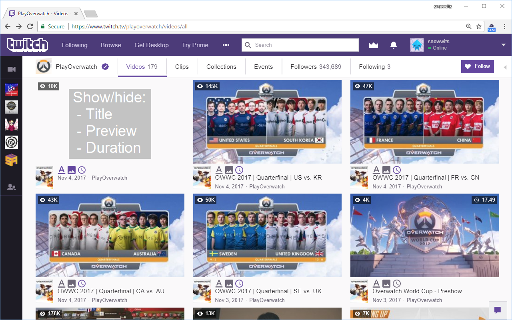

# Open End
Chrome extension that hides the duration of videos and other information on Twitch.tv to prevent spoilers when watching e-sports or sports videos.

# Table of Contents  
1. [Description](#1-description)  
2. [Features](#2-features)
3. [Usage](#3-usage)
4. [Supported Video Platforms](#4-supported-video-platforms)
5. [Version Notes and Roadmap](#5-version-notes-and-roadmap)
6. [Contact](#6-contact)
7. [License](#7-license)
8. [Credits](#8-credits)

## 1. Description 
Sometimes you can't or don't want to watch a e-sports or sports event live. But when you are watching the videos later, the titles, previews or durations of videos can often give away the ending. For example, if you are watching a best-of-3 series and the video has almost reached its end during second match, you know that it will be a 2:0 victory.
Or if you are scrolling through a video list to find the semifinals videos and accidentally read the finalists names in the grand final video title, the excitement for the semifinals quickly fades away.

Open End prevents those kinds of spoilers by hiding certain information on Twitch.tv. Its features include:

### 1.1 Installation
You can install it via the Chrome Web Store:

https://chrome.google.com/webstore/detail/open-end/bgajbplcmfhpfebhiigohjannldlolpf

## 2. Features
### 2.1 Main Feature: Spoiler-Free Mode
- Hides the progress and duration of the video you are currently watching.
- Hides the title, preview and duration of other videos (suggested/related videos, videos in video lists).
- Provides a Video Navigation Toolbar to mitigate the lack of a seek bar.

### 2.2 Minor Features
- Fine-grained control over on which video platforms or channels the Spoiler-Free Mode should be enabled.
  - For example enable it on tournament channels but not on streamer channels.
  - Enabling/disabling of the Spoiler-Free Mode can be done quickly via the Open End icon.
- What information should be hidden is customizable.
- The visibility of any hideable element can be toggled directly on the page (no need to refresh the page)
- Option changes are directly applied (no need to refresh the page).
- Auto-enter the Theatre Mode.
- 100% compatible with [Better Twitch TV](https://chrome.google.com/webstore/detail/betterttv/ajopnjidmegmdimjlfnijceegpefgped).

## 3. Usage

### 3.1 Overview
- **Open End icon / Popup:** The extension has an icon in the Chrome toolbar (next to the address bar). If you click on it, a popup opens. The icon and the popup have two purposes:
  1. Inform you:
     - Whether the current web page is a supported video platform.
       - On supported platforms the icon is colored, otherwise it is grey.
     - Whether the Spoiler-Free Mode is active on the current web page.
       - When the Spoiler-Free Mode is active, the icon has an "SFM" badge.
     - The current status is also displayed on the popup.
  2. Provide quick access to the most important options. On the popup you can quickly:
     - Enabled/disable the Spoiler-Free Mode vor a video platform or a channel.
       - See [3.2 Enable/Disable the Spoiler-Free Mode](#32-enabledisable-the-spoiler-free-mode).
     - Open the options page.
- **Video Navigation Toolbar:** If the Spoiler-Free Mode is enabled, a Video Navigation Toolbar will be added to the video player because the regular seek bar will be hidden.
  - The toolbar provides:
    - A button to show/hide the seek bar and duration in case you need it.
    - Buttons to quickly navigate in the video without the seek bar.
  - To learn how to navigate in a video, see [3.4 Video Navigation](#34-video-navigation).
  - The toolbar can be configured in the options.
- **Video Lists:** Open End can hide certain information about videos in videos lists to prevent spoilers, such as video title, video preview and video duration.
  - What information is hidden can be customized in the options, see [3.3 Customize the Spoiler-Free Mode](#33-customize-the-spoiler-free-mode).
- **Options:** On the popup you can click on the "Options..." button to open the options of the extension. Feel free to explore the options and customize the extension according to your preferences.

#### 3.1.1 Example Screenshots

### 3.2 Enable/Disable the Spoiler-Free Mode
There are three layers to give you fine control over where to enable/disable the Spoiler-Free Mode.
1. **Global:** Enable/disable the Spoiler-Free Mode globally. You can choose between:
   - *Never:* Disable the Spoiler-Free Mode globally.
   - *Always:* Enable the Spoiler-Free Mode globally.
   - *Platform-dependent:* Defer the decision to the platform level.
2. **Platform:** Enable/disable the Spoiler-Free mode for a specific video platform. You can choose between:
   - *Never:* Disable the Spoiler-Free Mode on this platform.
   - *Always:* Enable the Spoiler-Free Mode on this platform.
   - *Channel-dependent:* Defer the decision to the channel level.
     - If channels are supported on this platform. For example on Twitch.tv channels are supported, on MLG.com they are not.
3. **Channel:** Enable/disable the Spoiler-Free mode for a specific video channel. You can choose between:
   - *Disable:* Disable the Spoiler-Free Mode on this channel.
   - *Enable:* Enable the Spoiler-Free Mode on this channel.

Settings on higher layers have priority over settings on lower layers.
For example, settings on the platform and channel level only have an effect if the global setting is set to "Platform-dependent".

#### 3.2.1 How to Enable/Disable the Spoiler-Free Mode

- **Option A:** Via the popup:
  1. Click on the Open End icon in the Chrome toolbar to open the popup.
  2. On the popup you can enable/disable the Spoiler-Free Mode globally and also for the current video platform and channel if you are on a platform or channel page.
- **Option B:** Via the options:
  1. Click on the Open End icon in the Chrome toolbar to open the popup.
  2. On the popup click on *"Options..."* to open the options.
  3. Go to the section *"Enable Spoiler-Free Mode"*.
  4. Enable/Disable the Spoiler-Free Mode globally and/or for specific video platforms and channels.
  
### 3.3 Customize the Spoiler-Free Mode
1. Click on the Open End icon in the Chrome toolbar to open the popup.
2. On the popup click on *"Options..."* to open the options.
3. Go to the section *"Customize Spoiler-Free Mode"*.
4. Customize the options according to your preferences.

### 3.4 Video Navigation
- Like always, you can use the Arrow Left/Arrow Right keys (<-, ->) on your keyboard for 5 second time jumps.
- If a video is run in Spoiler-Free Mode, Open End adds a Video Navigation Toolbar which you can use to make larger time jumps.
- The length of the time jumps can be specified in the same format as Twitch time stamps:
  - E.g. \"2\" for 2 minutes or \"1h2m3s\" for 1 hour, 2 minutes and 3 seconds".
- The time jumps are done by rapidly seeking through the video so longer time jumps may take some seconds.
  
#### 3.4.1 Keyboard/Mouse Shortcuts
- When the focus is on the time jump input field (click with the mouse in it), the following keyboard / mouse actions are supported:
  - **Arrow Up/Arrow Down** or **Mouse Wheel:**
    - Change the current time jump length to one step higher/lower.
    - Steps are usually full minutes. However, under a minute additional steps at 30 seconds and 5 seconds are available.
  - **Enter:** Execute a forward jump.
  - **Shift + Enter:** Execute a backward jump.

## 4. Supported Video Platforms

### 4.1 Twitch.tv

Twitch.tv is **fully** supported.

### 4.2 MLG.com

There is only **limited** support for MLG.com and overwatchleague.com (which uses the MLG.com video platform):
- Only the hiding of the seek bar and video duration of currently played videos is supported.
  - No Video Navigation Toolbar is provided.

## 5. Version Notes and Roadmap
[See here](docs/VERSION_NOTES.md)

## 6. Contact
If you have questions or feature requests you can contact me:
- Mail: [snowwits@gmail.com](mailto:snowwits@gmail.com)
- Reddit: [/u/snowwits](https://www.reddit.com/user/snowwits)
- Twitter: [@snowwits](https://twitter.com/snowwits)
  - Follow to receive update news

## 7. License
Exclusive copyright for now.

## 8. Credits
- Google: Material Design icons
  - https://www.flaticon.com/packs/material-design